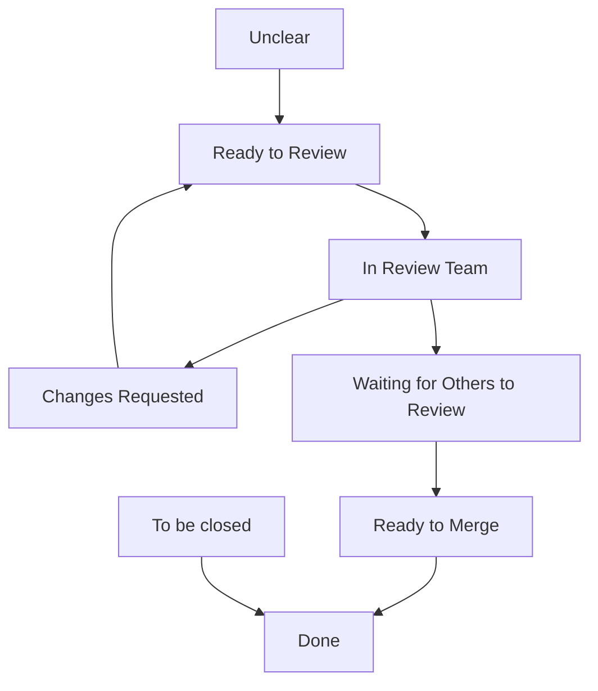

#  Pull Request (PR) Review Process

Pull Requests (PRs) are a fundamental part of our development workflow. They enable collaboration, ensure code quality, and provide a structured mechanism for peer review. A well-defined PR review process not only improves the stability and readability of our codebase, but also encourages knowledge sharing and collective ownership among team members.

This document serves as a guide for the entire PR lifecycle and review process, from creation to completion — by defining each status, outlining the responsibilities of the author and reviewers, and establishing best practices. Following this workflow will help ensure clarity, consistency, and efficiency across our engineering team.

Use this guide as a reference to:
- Understand the meaning and purpose of each PR status
- Know what actions to take at every stage
- Communicate effectively during the review process
- Improve turnaround time and reduce merge conflicts

---

## 🔄 Types of PR Lifecycle Status

### 1. 🟡 Unclear
- **Definition:** The PR is open but lacks critical information such as purpose, context, or a clear problem statement. Reviewers are uncertain about what is expected or whether the PR is ready for review.
- **Action:** The PR author must update the description, clarify the scope, link relevant issues or documentation, and ensure the PR is complete enough to be reviewed.
- **Owner:** PR Author

---

### 2. 🟢 Ready to Review
- **Definition:** The PR is considered complete from the author’s side and is ready to be evaluated. It should be in a clean state with all relevant changes pushed.
- **Checklist:**
  - All required code changes and commits are included.
  - PR description is detailed and includes context, purpose, and any linked issues.
  - CI/CD checks (tests, linters, etc.) have passed.
- **Action:** The author should notify assigned reviewers or tag relevant team members to begin the review process.
- **Owner:** PR Author

---

### 3. 🧑‍💻 In Review Team
- **Definition:** The PR has been acknowledged by one or more reviewers, and it is actively under review. Feedback may be ongoing or final decisions may be pending.
- **Action:** Reviewers should assess the code quality, test coverage, and adherence to standards. Constructive feedback or approval should be provided in a timely manner.
- **Owner:** Reviewers

---

### 4. 🔁 Changes Requested
- **Definition:** Reviewers have reviewed the PR and determined that changes are needed before approval. These could include code fixes, style improvements, performance optimizations, or documentation updates.
- **Action:** The PR author must address all comments and push the required changes. Once updates are made, the reviewers should be notified to re-review.
- **Owner:** PR Author

---

### 5. ⏳ Waiting for Others to Review
- **Definition:** The PR has been reviewed once and approved, but is still pending review from additional team members. 
- **Action:** Reviewers who have not yet reviewed should prioritize reviewing the PR to avoid blocking progress.
- **Owner:** Reviewers

---

### 6. ✅ Ready to Merge
- **Definition:** All required reviews have been completed, changes have been accepted, and CI pipelines are passing. The PR is now eligible to be merged into the main codebase.
- **Action:** The maintainer or authorized team member should proceed with the merge, following the appropriate merge strategy (e.g., squash, rebase, or merge commit).
- **Owner:** Maintainer

---

### 7. 🗃️ To Be Closed
- **Definition:** The PR is no longer relevant or necessary, either due to project direction changes, duplication, or better alternatives implemented elsewhere.
- **Action:** Leave a clear comment explaining the rationale for closing the PR. Then close it gracefully.
- **Owner:** PR Author or Maintainer

---

### 8. 🏁 Done
- **Definition:** The PR has been successfully merged or intentionally closed. All related work is considered complete and requires no further action.
- **Action:** No action required. Follow-up tasks (if any) should be documented in related issues or project boards.
- **Owner:** System / Maintainer

---

## 📊 Summary Table

| **Status**                  | **Definition**                                                                 | **Owner**           | **Action Required**                                                                 |
|-----------------------------|---------------------------------------------------------------------------------|---------------------|-------------------------------------------------------------------------------------|
| Unclear                     | PR lacks context or clarity.                                                   | PR Author           | Add description, clarify intent, link issues.                                       |
| Ready to Review             | PR is complete and ready for review.                                           | PR Author           | Notify reviewers, ensure CI passes, add context.                                   |
| In Review Team              | Reviewers are actively reviewing the PR.                                       | Reviewers           | Review code, leave comments or approvals.                                          |
| Changes Requested           | Reviewers have asked for updates.                                              | PR Author           | Implement changes, respond to comments, push updates.                              |
| Waiting for Others to Review| PR is pending additional review(s).                                            | Reviewers           | Remaining reviewers should review and respond.                                     |
| Ready to Merge              | All approvals are in; the PR is good to go.                                    | Maintainer | Merge the PR following branch strategy and CI validation.                          |
| To Be Closed                | PR is no longer needed or valid.                                               | Author / Maintainer | Close the PR with a comment explaining why.                                        |
| Done                        | PR is merged or closed with no further actions required.                        | System              | No further action needed.                                                          |

## Flow Diagram

