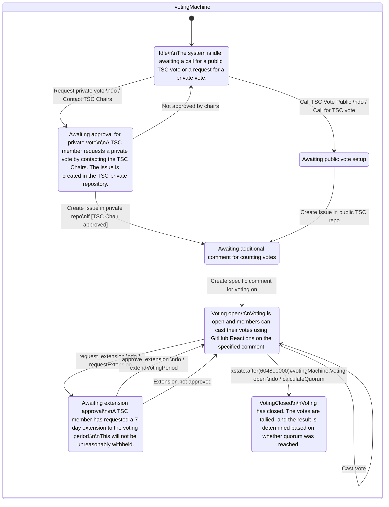

# Supporting information for the governance process

For the governance process of the JSON Schema Project, see the primary [GOVERNANCE.MD](https://github.com/json-schema-org/community/blob/main/GOVERNANCE.md) document.

This document provides supporting resources in acknowledgement that parsing legalistic governance process documents can sometimes take considerable effort, and humans are error prone.

## Workflow for voting

The governance document specifies two ways to make decisions, decision making via consensus and decision making via voting.

This section details the workflow of the voting process.
(The voting process may be different to the voting process found as part of the quick consensus process.)

The following is a diagram generated from a Finite State Machine (FSM) created in Stately.ai.
One output is Mermaid, which is a diagram format rendered by GitHub!
It is not as good as viewing the Finite State Machine on Stately, which I would recommend, but it does give you an idea of what to expect.

When you [view this FSM on Stately](https://stately.ai/registry/editor/embed/c53f8d7e-78fa-420e-bec7-59b8ce2471dd?machineId=140d0a50-b21c-462e-99d5-f13231127cb2), you can "run the simulation" (bottom right button) and step through the process, selecting the next action at each state.

While this isn't a traditional flowchart, I feel the ability to interact with and step through the process outweighs any potential familiarity with flowchart diagrammatic representation.

